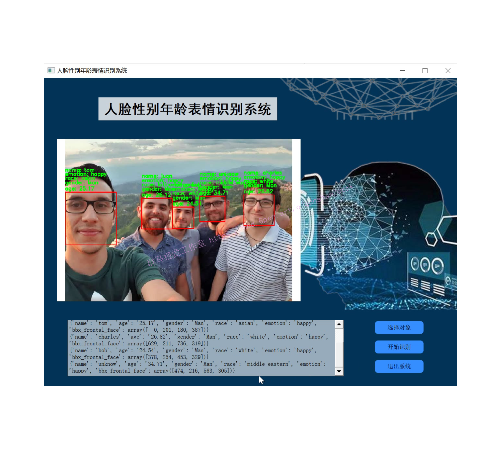
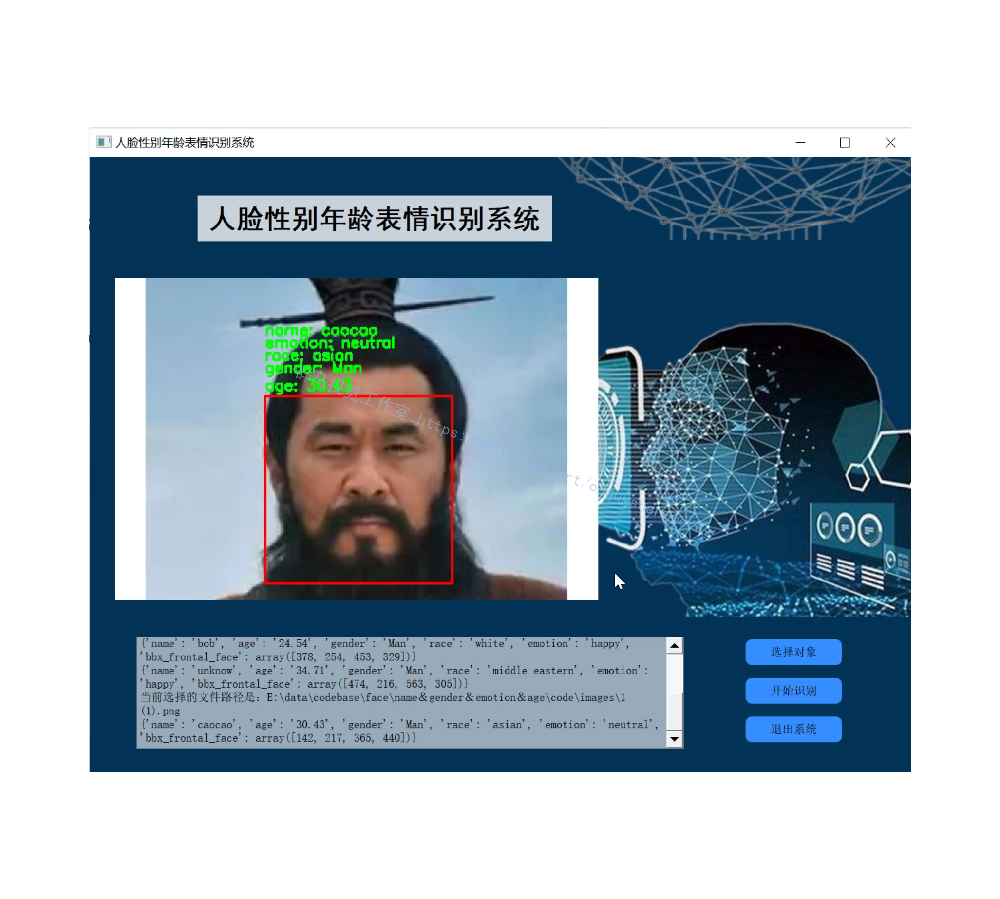
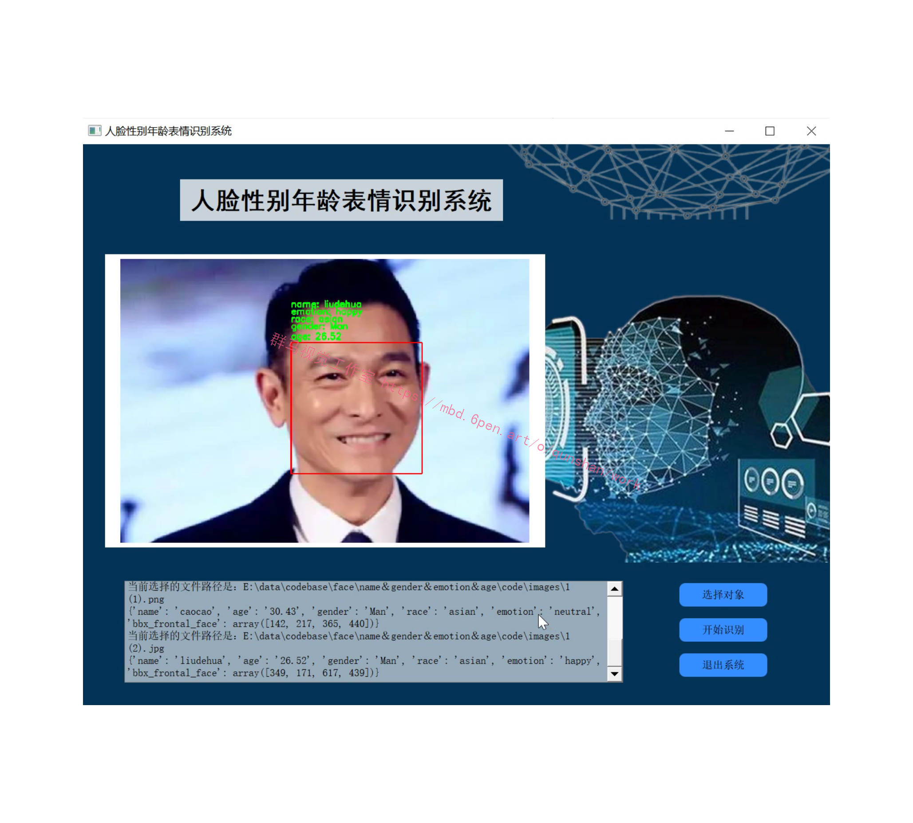
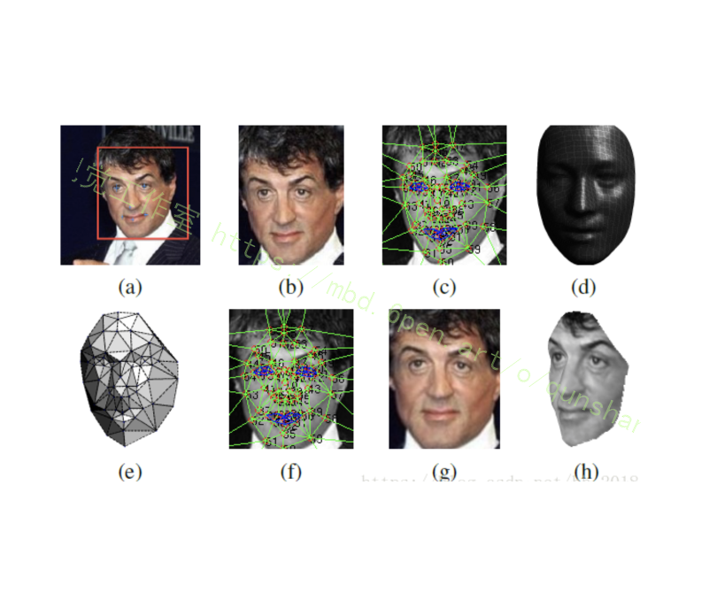
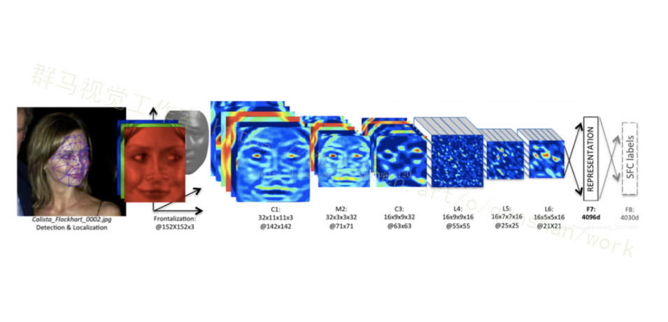
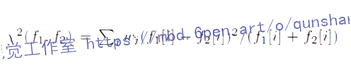

# 1.研究背景
性别识别是利用计算机视觉来辨别和分析图像中的人脸性别属性。一直以来，人脸性别识别的发展虽然很迅速但是应用范围目前并不是很广，在身份证识别上的应用是主体应用。伴随的还有视频检索和机器人视觉，它们也是应用的重要领域。所以目前针对人脸性别识别的研究方向也在不断探索。
性别识别等应用程序最适合用于“人口调查”，比如监控那些在一家公寓商店购物的人的数量。这些类型的调查可以帮助你优化商店的布局，从而销售量增加。
分类和回归在原理上大同小异，它主要取决于因变量。如果因变量是离散的，那么问题可以说是分类问题，但是如果因变量是连续的，那么问题又可以归于回归问题。年龄这也是这样。如果将年龄分成几类，比如:少年、青年、中年和老年时，年龄估计就是分类问题5l﹔如果我们需要精准估计到详细的年龄⒃l，这时便是回归问题。
显然，年龄估计问题比性别识别更复杂。原因如下:即使是用人眼，年龄特征在人的外表上也很难被精确地看出来。而且年龄特征通常表现在脸部皮肤纹理、颜色、光亮程度以及皱纹纹理等方面，但这些特征普遍跟个人的遗传基因、性别、生活习惯以及性格和工作环境等相关。因此，我们很难应用同一的模型去估计人脸图像的年龄。如果想更好的估出人的年龄层，那么我们需要大批样本的学习。

# 2.识别效果






# 3.视频演示
[基于Opencv的人脸＆姓名＆表情＆年龄＆种族＆性别识别系统（源码＆教程）_哔哩哔哩_bilibili](https://www.bilibili.com/video/BV12V4y1M7RW/?vd_source=bc9aec86d164b67a7004b996143742dc)


# 4.人脸检测（face detection）
本文采用了基于检测点的人脸检测方法（fiducial Point Detector）

1、先选择6个基准点，2只眼睛中心、 1个鼻子点、3个嘴上的点。

2、通过LBP特征用SVR来学习得到基准点。关于LBP的介绍见地址：[https://blog.csdn.net/qq_32172681/article/details/100014705](https://blog.csdn.net/qq_32172681/article/details/100014705)

# 5.人脸对齐（face alignment）
受[该博客的启发在对齐方面，采用了3D对齐的方式](https://afdian.net/item?plan_id=c0eb5c465cba11ed8f7452540025c377)，并且使用传统的LBP直方图（首先通过设置阀值并以某一像素点为中心邻域内的像素点一起和阀值比较，当大于阀值时就将其变为1小于阀值就变成0，然后在做成直方图统计各区域像素出现的次数）进行图片纹理化并提取对应的特征。对提取出的特征使用SVR处理以提取出人脸及对应的六个基本点。根据六个基本点做仿射变化，再根据3D模型得到 对应的67个面部关键点，根据这些点做三角划分最终得出对应的3D人脸。其具体对齐流程如下：


a: 检测出人脸和对应的6个基本点

b: 二维对齐后的人脸

c: 使用狄罗尼三角划分在2D人脸上划分出67个关键点，并在边缘处采用添加三角形的方式避免不连续

d: 转化为2D平面并和原始2D图片进行比较时所需的标准3D人脸模型（通过标准3D人脸库USF生成的对应的平均人脸模型）

e: 3D-2D转化（标准3D脸转化为2D和原有的2D做残差使用）时所需要的变化，黑色部分表示不可见的三角形。对应不可见的三角形处理采用的是对称方式解决的。

f: 通过3D模型产生的67个基准点进行分段映射使人脸变弯曲，对人脸进行对齐处理。

g: 处理生成的2D人脸

h: 根据处理生成的3D人脸

其中：c和f相比经过了标准3D人脸转化为 2D人脸时的残差处理，此时主要是为保证在转化过程中特征的保留。e的作用是为了显示在处理过程中3D-2D转化为何是通过三角形的仿射变化进行的，由e可以看出处理后的人脸是一个个的三角形块。

# 6.人脸表示（face verification）
该[博客提出的3D对齐方案](https://mbd.pub/o/bread/Y5eZkpdv)，形成的图像都是152×152的图像，送入CNN，其结果如下：


C1：卷积层，卷积核尺寸11*11，共32个卷积核

M2：池化层，最大池化3*3，即stride = 2

C3：卷积层，卷积核尺寸9*9   ，共16个卷积核

L4： 卷积层，卷积核尺寸9*9   ，共16个卷积核。L表示local，意思是卷积核的参数不共享

L5： 卷积层，卷积核尺寸7*7   ，共16个卷积核。L表示local，意思是卷积核的参数不共享

L6： 卷积层，卷积核尺寸5*5   ，共16个卷积核。L表示local，意思是卷积核的参数不共享

F7： 全连接，4096个神经元

F8： 全连接，4030个神经元

前三层的目的在于提取低层次的特征，比如简单的边和纹理。其中Max-pooling层使得卷积的输出对微小的偏移情况更加鲁棒。但没有用太多的Max-pooling层，因为太多的Max-pooling层会使得网络损失图像信息。除了不共享的卷积之外，该模型还采用了dropout方式避免模型的过拟合，该方法只是在F7的时候使用。

紧接着的三层都是使用参数不共享的卷积核，之所以使用参数不共享，有如下原因：

对齐的人脸图片中，不同的区域会有不同的统计特征，卷积的局部稳定性假设并不存在，所以使用相同的卷积核会导致信息的丢失
不共享的卷积核并不增加抽取特征时的计算量，而会增加训练时的计算量
使用不共享的卷积核，需要训练的参数量大大增加，因而需要很大的数据量，然而这个条件本文刚好满足。
全连接层将上一层的每个单元和本层的所有单元相连，用来捕捉人脸图像不同位置的特征之间的相关性。其中，第7层（4096-d）被用来表示人脸。全连接层的输出可以用于Softmax的输入，Softmax层用于分类。

# 6.人脸表示的归一化

归一化的主要是将人脸的特征值都变为（0,1）之间，避免光照等其他因素的影响。其归一化的方式为：先对每一维进行归一化，每一维除以该维的最大值，再将整个向量归一化。

# 7.分类（鉴定度量）

鉴定度量是归一化后的结果用来进行身份验证使用的，也是一种其他的可用来分类时的度量，主要在计算相似度方面起作用。可以代替最后一层softmax层对图片进行处理，也可以对处理后的结果采用度量计算相似度。

其分类的度量方式主要有三种：1：内积，2：卡方加权，3：siamese网络

1. 对于内积直接进行计算不做介绍：

2. 卡方加权的方式如下：



其中f表示归一化后的特征，w是通过SVM学习到的参数。

3. siamese网络：

使用成对的图片进行训练，保证了可以使用特征之间的绝对不同而不是简单的逻辑不同。同时由于两张图片虽然采用了相同的参数，但是由于要运算两次，所以其对应的网络计算量并无差异（原始处理两张图片相比）。该距离可以用来比较两张图片是不是一个人。

# 8.代码实现
```
import cv2
import numpy as np
import face_recognition
from age_detection import f_my_age
from gender_detection import f_my_gender
from race_detection import f_my_race
from emotion_detection import f_emotion_detection
from my_face_recognition import f_main


# instanciar detectores
age_detector = f_my_age.Age_Model()
gender_detector =  f_my_gender.Gender_Model()
race_detector = f_my_race.Race_Model()
emotion_detector = f_emotion_detection.predict_emotions()
rec_face = f_main.rec()
#----------------------------------------------


def get_face_info(im):
    # face detection
    boxes_face = face_recognition.face_locations(im)
    out = []
    if len(boxes_face)!=0:
        for box_face in boxes_face:
            # segmento rostro
            box_face_fc = box_face
            x0,y1,x1,y0 = box_face
            box_face = np.array([y0,x0,y1,x1])
            face_features = {
                "name":[],
                "age":[],
                "gender":[],
                "race":[],
                "emotion":[],
                "bbx_frontal_face":box_face             
            } 

            face_image = im[x0:x1,y0:y1]

            # -------------------------------------- face_recognition ---------------------------------------
            face_features["name"] = rec_face.recognize_face2(im,[box_face_fc])[0]

            # -------------------------------------- age_detection ---------------------------------------
            age = age_detector.predict_age(face_image)
            face_features["age"] = str(round(age,2))

            # -------------------------------------- gender_detection ---------------------------------------
            face_features["gender"] = gender_detector.predict_gender(face_image)

            # -------------------------------------- race_detection ---------------------------------------
            face_features["race"] = race_detector.predict_race(face_image)

            # -------------------------------------- emotion_detection ---------------------------------------
            _,emotion = emotion_detector.get_emotion(im,[box_face])
            face_features["emotion"] = emotion[0]

            # -------------------------------------- out ---------------------------------------       
            out.append(face_features)
    else:
        face_features = {
            "name":[],
            "age":[],
            "gender":[],
            "race":[],
            "emotion":[],
            "bbx_frontal_face":[]             
        }
        out.append(face_features)
    return out


def bounding_box(out,img):
    for data_face in out:
        box = data_face["bbx_frontal_face"]
        if len(box) == 0:
            continue
        else:
            x0,y0,x1,y1 = box
            img = cv2.rectangle(img,
                            (x0,y0),
                            (x1,y1),
                            (0,0,255),2);
            thickness = 2
            fontSize = 0.6
            step = 13

            try:
                cv2.putText(img, "age: " +data_face["age"], (x0, y0-7), cv2.FONT_HERSHEY_SIMPLEX, fontSize, (0,255,0), thickness)
            except:
                pass
            try:
                cv2.putText(img, "gender: " +data_face["gender"], (x0, y0-step-15*1), cv2.FONT_HERSHEY_SIMPLEX, fontSize, (0,255,0), thickness)
            except:
                pass
            try:
                cv2.putText(img, "race: " +data_face["race"], (x0, y0-step-15*2), cv2.FONT_HERSHEY_SIMPLEX, fontSize, (0,255,0), thickness)
            except:
                pass
            try:
                cv2.putText(img, "emotion: " +data_face["emotion"], (x0, y0-step-15*3), cv2.FONT_HERSHEY_SIMPLEX, fontSize, (0,255,0), thickness)
            except:
                pass
            try:
                cv2.putText(img, "name: " +data_face["name"], (x0, y0-step-15*4), cv2.FONT_HERSHEY_SIMPLEX, fontSize, (0,255,0), thickness)
            except:
                pass
    return img

```

# 9.系统整合
下图[源码＆环境部署视频教程＆自定义UI界面](https://s.xiaocichang.com/s/9263d8)

参考博客[《基于Opencv的人脸＆姓名＆表情＆年龄＆种族＆性别识别系统（源码＆教程）》](https://mbd.pub/o/qunma/work)


# 10.参考文献
[1]周健,叶金晶,孙谦晨,等.主动毫米波成像性别识别算法研究[J].红外.2018,(9).34-40.DOI:10.3969/j.issn.1672-8785.2018.09.006.
[2].Parallelization and Performance Optimization on Face Detection Algorithm with OpenCL: A Case Study[J].清华大学学报（英文版）.2012,17(3).287-295.DOI:10.3969/j.issn.1007-0214.2012.03.008.
[3]Young-joon OH,Jong-in KIM,Taeh-yun YOON,等.Face Detection from Four Captured Images Related to Intelligent Room for the Deaf[J].测试科学与仪器.2010,(4).338-342.
[4]KONG Wan-zeng,ZHU Shan-an.Multi-face detection based on downsampling and modified subtractive clustering for color images[J].浙江大学学报A（英文版）.2007,(1).72-78.
[5]李海燕,余鹏飞,周浩.基于贝叶斯判别器的面部检测[J].云南大学学报（自然科学版）.2006,(4).303-306.
[6]王涛,卜佳俊,陈纯.A color based face detection system using multiple templates[J].浙江大学学报(英文版).2003,(2).162-165.
[7]WU Jinsong,CHEN Xiancheng,SHI Yuquan.Noninvasive three-dimensional computed tomographic angiography in preoperative detection of intracranial arteriovenous malformations[J].中华医学杂志英文版.2000,(10).915.
[8]Zhang Xu,Zhang Shujun,HAPESHI Kevin.A new method for face detection in colour images for emotional bio-robots[J].中国科学：技术科学（英文版）.2010,(11).2983-2988.
[9]杜娟.基于OpenCV的人脸识别算法研究[D].2018
[10]王弯弯.自然场景下的侧脸检测研究[D].2017
[11]NIYOYITA Jean Paul.Multiview face detection using six segmented rectangular filters and skin tone information[D].2009
[12]陈煜.人脸检测跟踪算法的研究与基于DaVinci的人脸检测系统实现[D].2008
[13]林鹏.基于Adaboost算法的人脸检测研究及实现[D].2007
[14]Srivastava, Nitish,Hinton, Geoffrey,Krizhevsky, Alex,等.Dropout: A Simple Way to Prevent Neural Networks from Overfitting.[J].Journal of Machine Learning Research.2014,15(6).1929-1958.
[15]Caifeng Shan.Learning local binary patterns for gender classification on real-world face images[J].Pattern Recognition Letters.2012,33(4).
[16]P. Haffner,L. Bottou,Y. Bengio,等.Gradient-based learning applied to document recognition[J].Proceedings of the IEEE.1998,86(11).
[17]S, Hochreiter,J, Schmidhuber.Long short-term memory.[J].Neural computation.1997,9(8).1735-80.
[18]LeCun, Y,Boser, B,Denker, J,等.Backpropagation Applied to Handwritten Zip Code Recognition[J].Neural Computation.1989,1(4).541-551.
[19]K, Fukushima.Neocognitron: a self organizing neural network model for a mechanism of pattern recognition unaffected by shift in position.[J].Biological cybernetics.1980,36(4).193-202.


---
#### 如果您需要更详细的【源码和环境部署教程】，除了通过【系统整合】小节的链接获取之外，还可以通过邮箱以下途径获取:
#### 1.请先在GitHub上为该项目点赞（Star），编辑一封邮件，附上点赞的截图、项目的中文描述概述（About）以及您的用途需求，发送到我们的邮箱
#### sharecode@yeah.net
#### 2.我们收到邮件后会定期根据邮件的接收顺序将【完整源码和环境部署教程】发送到您的邮箱。
#### 【免责声明】本文来源于用户投稿，如果侵犯任何第三方的合法权益，可通过邮箱联系删除。